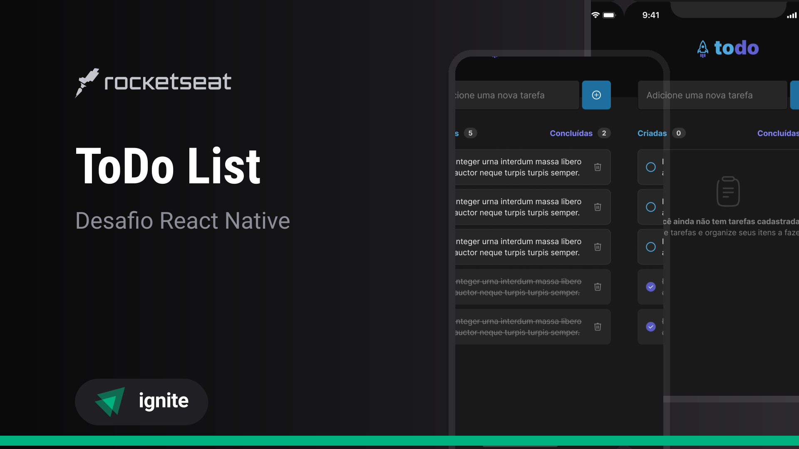
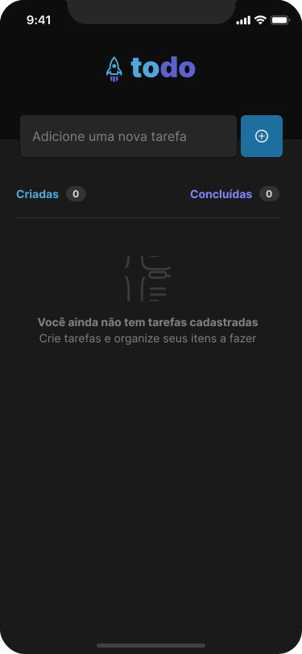
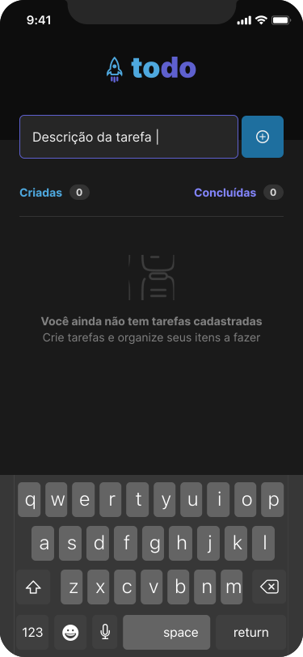
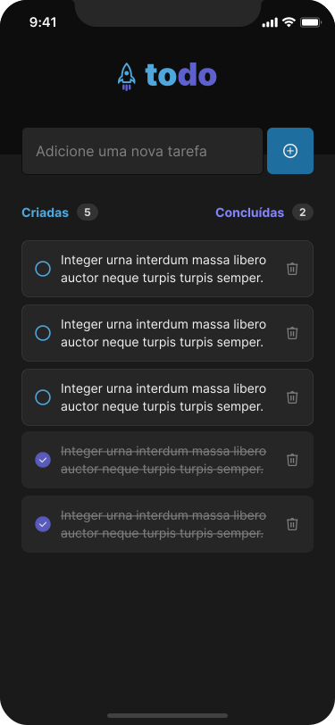

<h1 align="center">
    
    <br>
    todo
    <br>
    
    
    
    
</h1>

<div align="center">
    <h4 style="margin-bottom: 0;"> 🏁  Finished.  🏁</h4>
    <h5 style="margin-top: 0;">(for now)</h5>
</div>

<p align="center">todo is a project developed at the ignite bootcamp of Rocketseat company using React Native.</p>

<p align="center">
 <a href="#-goal">Goal</a> •
 <a href="#-features">Features</a> • 
 <a href="#-requirements">Requirements</a> • 
 <a href="#%EF%B8%8F-runing-project-%EF%B8%8F">Running project</a> • 
 <a href="#-technologies">Technologies</a> • 
 <a href="#%EF%B8%8F-author">Author</a>
</p>

## 🎯 Goal

<p align="center">todo is a project developed to help you keep track of your daily tasks! It let's you add, remove and set a task as done in a beautifully designed and easy to use to-do list</p>

### 📱 Mobile

<div align="center">
    
    
    
</div>

## 🎩 Features

- [x] Add task
- [x] Mark and unmark a task as done
- [x] Remove task from list
- [x] Show progress count of completed tasks

## 👨🏻‍🔬 Requirements

Before we begin, you'll need to have the following installed:
[Git](https://git-scm.com) and [NPM](https://www.npmjs.com/).
Besides, it would be great that you have a code editor to work on this project, such as [VSCode](https://code.visualstudio.com/).

## 🏃‍♀️ Runing project 🏃‍♂️

```bash
#### Start mobile app ####

# Access project folder from a terminal
$ cd to-do-list

# Install dependencies
$ npm i

# run expo server
$ npx expo start

# follow the steps that will appear on yout terminal
 You will proabably be able to chose between this options:
 - Scan QR code from terminal with Expo Go (Android) or the Camera app (iOS)
 - Press a to open an Android emulator
 - Press i to open iOS simulator
```

## 🛠 Technologies

- [React Native](https://reactnative.dev/)
- [Expo](https://expo.dev/)
- [TypeScript](https://www.typescriptlang.org/)
- [VS Code](https://code.visualstudio.com/)

## ✍️ Author
---
<br />

<br />
<sub><b>Thales Sarubbi</b></sub>


Made with 💙 by Thales Sarubbi 🗣 Let's talk!


[](https://www.linkedin.com/in/thales-sarubbi/) 
[](mailto:thalessarubbi@gmail.com)
[](https://medium.com/@thalessarubbi_37827)
